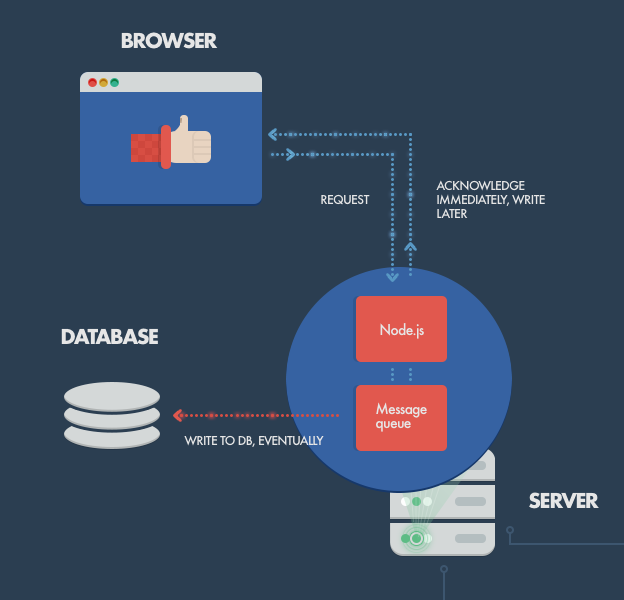
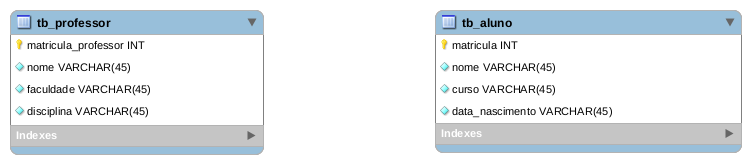

# Microservice-asa

Trabalho da disciplina de Arquitetura de Software Aplicada (Microsserviço + ORM + Boostrap + Docker)

# Executando o projeto

```bash
docker-compose up
```

# Arquitetura do projeto

<p align="center">
  
</p>

Toda a arquitetura está divida em três containers

- Cliente: Consumindo recolhendo dados do usuário e consumindo recursos dos microsserviços

- Microsserviços: Recebendo requisições do cliente e processando as mesmas sempre consultando o banco de dados relacional.

- Banco de dados: Fornecendo os dados aos serviços.

O Docker responsável por baixar imagens dos programas necessários e instanciandos containers, em seguida o Docker-compose levanta os containers e os conectam de maneira simples através do arquivo docker-compose.yml

# Banco de dados

<p align="center">
  
</p>
